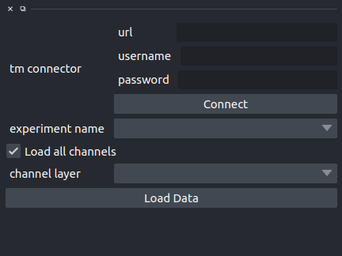

TissueMAPS Interface
-----------------------------------------

This plugin provides the interface to load and visualize data from a TissueMAPS server.
Data is streamed from server, loading only the minimal amount of data needed for the visualization
of the current zoom level. 

For this plugin to work optimally, the environment variable ``NAPARI_OCTREE`` should be set to 1.

The interface is integrated in a widget. To load the widget

``Plugin`` -> ``Add Dock Widget`` -> ``TissueMAPS Connection Widget``

``url`` is the TissueMAPS server URL
``username`` and ``password`` are the credential.

Once this data are set, you can click ``Connect``, and the dropdown 
``experiment`` will be populated with all the experiments available for the given user.

Selecting an experiment, will populate ``channel layer`` dropdown, allowing to select a given channel 
inside an experiment.

Finally the ``Load Data`` button will load the select channel in a new napari layer.
